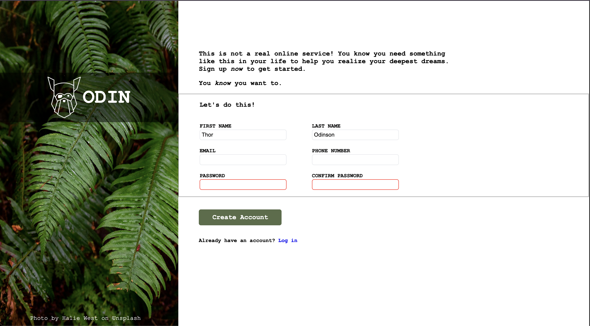

# Sign-Up Form

## Context
This project is based on the Sign-Up Form exercise. It focuses on replicating a professional, responsive sign-up page from a design reference, with an emphasis on semantic HTML, modern CSS layout techniques, and form validation.

## Skills and Tools Used
### HTML:
- Semantic elements: `<form>`, `<input>`, `<label>`, `<fieldset>`, `<legend>`
- Form attributes for validation: `required`, `type`, `minlength`, `pattern`

### CSS:
- Responsive layout using **Flexbox**
- Visual styling with colors, spacing, and typography
- Focus states and input highlighting
- Custom button styling and hover effects

### Additional Concepts:
- Client-side form validation using HTML5
- Accessibility considerations with `aria` attributes and `label` associations
- Matching a design closely using provided reference image

## Features
- **Fully Functional Form:** Includes input fields for user information with real-time HTML5 validation.
- **Visual Feedback:** Highlights active, valid, and invalid input fields.
- **Design Accuracy:** Closely mirrors a professional mockup image using only HTML and CSS.

## Final Product
Below is a sample screenshot of the Sign-Up Form project:

